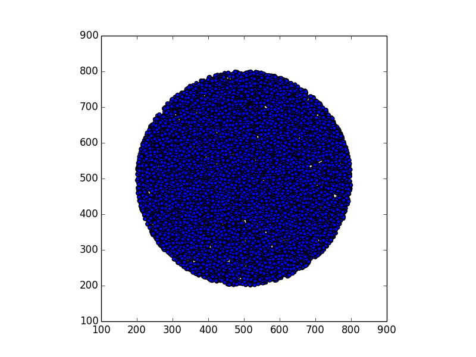
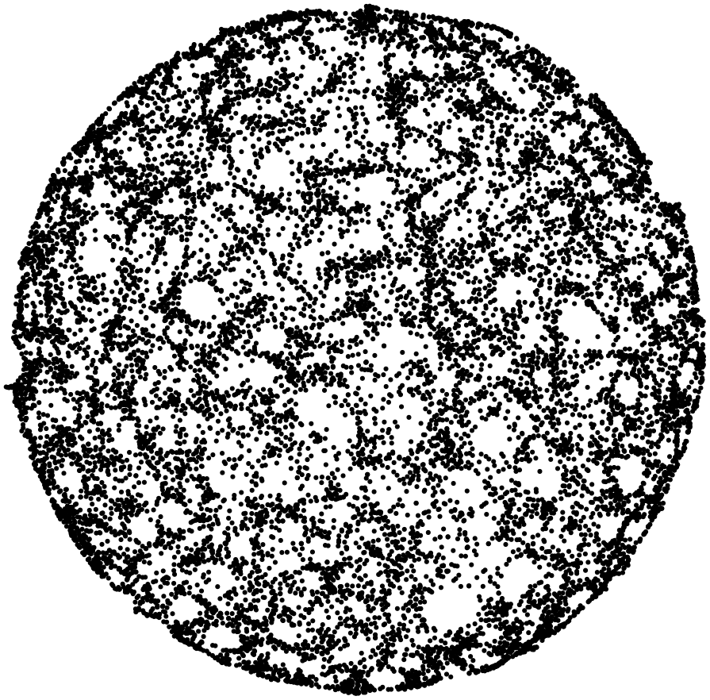

# Recovering area shapes from anonymous contact tracing data

## Introduction
The actual COVID-19 pandemic has induced many governments to call for technological solutions for tracing contacts between people. [Dozens of applications](https://en.wikipedia.org/wiki/COVID-19_apps) have been introduced so far, basically boiling down to five main frameworks: PEPP-PT, Google/Apple Privacy Preserving Tracing Project (GA-PPTP), DP-3T, Blue Trace and TCN; a detailed comparison between these approaches is outside the scope of this project (see e.g. [here](https://www.cybersecurity360.it/nuove-minacce/app-di-contact-tracing-come-funzionano-rischi-di-sicurezza-e-soluzioni-di-mitigazione/) and [here](https://github.com/shankari/covid-19-tracing-projects)).

A common problem with all these approaches is the privacy of users: we would like to trace who has been in contact with an infected patient, without revealing their real positions and movements. This is even more important in centralized-based solutions (such as PEPP-PT), where tracing data is stored "in the cloud" or on servers run either by the Government or by some private institution.
To this end, several anonymization techniques are used; for instance, the "tags" that the apps exchange via Bluetooth, and eventually upload on the servers, are random-like strings like `387e07342c243b50a05da363f67e17ea25fe03bc`, generated on a daily base (or more often) using hash functions. Even if these tags are calculated from some private/sensitive data (e.g. phone number, IMEI, Bluetooth MAC, GPS position), it is not possible to recover such data from the hash digest. In most protocols, no other information are exchanged between apps nor are uploaded to servers. Thus the user identity cannot be associated to tags. (In centralized solutions, however, the central service may geolocalize a device when the tracing app connects to the server, either for uploading its tags or for collecting the tags that new positive patients have uploaded.)

Now, a natural question arises: _can some sensible geographic information leak, even adopting strong anonymization techniques?_ In this project we will see that the answer is: _yes_. 
More precisely, we will see that from a (dense enough) set of anonymous contact trace data we can easily reconstruct quite precisely the geometric shape of the area from where the contact data come from. 

## Proximity graphs
The kind of datasets we consider are relations between users, or _points_, defined by their "contacts"; in the case of tracing apps, two points are related iff they have been close enough to exhange their anonymous tags. 
For instance, let us consider ten points randomly scattered on a 1000x1000 area, with a "proximity radius" of 100:


The corresponding relations can be represented as a undirected graph, which we call *proximity graph*. We will describe these graphs using the common [dot notation](https://www.graphviz.org/doc/info/lang.html). Hence, the dot file corresponding to the map above is:
```
graph G {
layout = sfdp;
node [shape=point];
0;
1;
2;
3;
4;
5;
6;
7 -- 3;
7 -- 4;
8 -- 6;
9 -- 2;
}
```
This is the kind of information that we can recover by observing the exchanged tags only. In fact, as we can see, all geometric (geographic) information is lost. 
These graphs can be drawn using a tool like graphviz:


and there is no resemblance between the proximity graph and the original map.

So, our privacy is preserved: points are anonymous, and geographic information are lost. Or maybe not? What happens when we move from this small example, to something more real?

# Increasing density

In this section we consider the case of 15.000 points (corresponding to 15.000 devices), scattered on an area inside a square of 1000x1000 units (a unit can be 1 meter, for instance). 
The shape of the area can be anything: a circle, a rectangle, a city center, a region, etc.

Given a shape, we 
1. generate a random map of 15.000 points within that shape
2. derive the proximity graph for these points, with a proximity distance of 10 units (Bluetooth can easily connect over 10 meters in absence of obstacles). Of course, in the proximity graph all coordinates and distance information are lost.
3. plot the proximity graph using a multi-scale force-directed approach (Fruchterman and Reingold, 1991). Basically, connections are seen as ``springs'', so that connected points are drawn closer to each other.
4. compare the resulting plot with the original map.

Here are some examples.




